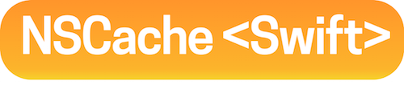

  

A Swift friendly drop-in replacement for `NSCache`, built on top of `NSCache` that provides:

- Type-safety
- Using vaue types as keys and values
- Subscripts

##Why?

`NSCache` is a great tool, but it lacks support for many Swift features, making its usage with Swift difficult:

    // NSCacheSwift usage:
    let image = cache["key"]
    
    // NSCache usage:
    let image = nscache.objectForKey("key") as! UIImage

##Installation

You can install the library using Carthage by adding the following line to your Cartfile:

	github "Ben-G/NSCacheSwift"

##Basic Usage

The API is a superset of the `NSCache` API.

**Creating a cache and adding a value:**

	var cache = NSCacheSwift <String, A> ()
	cache["key"] = A()
	
Besides the requirements for generic parameters, the API is identical to [`NSCache`](https://developer.apple.com/library/mac/documentation/Cocoa/Reference/NSCache_Class/index.html).
	
##Using Value Types

Unlike `NSCache`, `NSCacheSwift` allows you to use value types as keys and values. All value types that you want to use as a key in a `NSCacheSwift` need to conform to the `Hashable` protocol. Here's a type with an example implementation:

	struct B : Hashable {
	  var id: Int
	  
	  var hashValue: Int {
	    get {
	      return id
	    }
	  }
	}
	
When your type conforms to `Hashable` you can use it as a key as following:

    var cache = NSCacheSwift <B, String> ()
    cache[B(id:1)] = "OK"

#License
Released under the MIT license.

Permission is hereby granted, free of charge, to any person obtaining a copy of this software and associated documentation files (the "Software"), to deal in the Software without restriction, including without limitation the rights to use, copy, modify, merge, publish, distribute, sublicense, and/or sell copies of the Software, and to permit persons to whom the Software is furnished to do so, subject to the following conditions:

The above copyright notice and this permission notice shall be included in all copies or substantial portions of the Software.

THE SOFTWARE IS PROVIDED "AS IS", WITHOUT WARRANTY OF ANY KIND, EXPRESS OR IMPLIED, INCLUDING BUT NOT LIMITED TO THE WARRANTIES OF MERCHANTABILITY, FITNESS FOR A PARTICULAR PURPOSE AND NONINFRINGEMENT. IN NO EVENT SHALL THE AUTHORS OR COPYRIGHT HOLDERS BE LIABLE FOR ANY CLAIM, DAMAGES OR OTHER LIABILITY, WHETHER IN AN ACTION OF CONTRACT, TORT OR OTHERWISE, ARISING FROM, OUT OF OR IN CONNECTION WITH THE SOFTWARE OR THE USE OR OTHER DEALINGS IN THE SOFTWARE.
